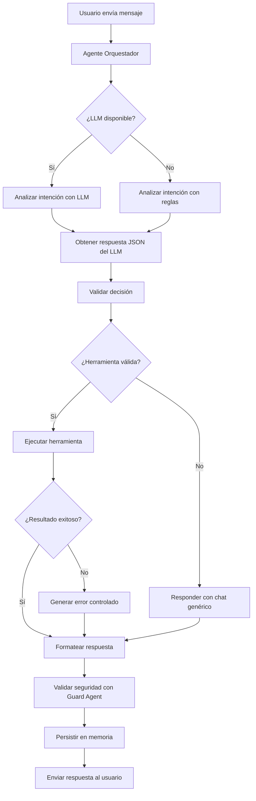
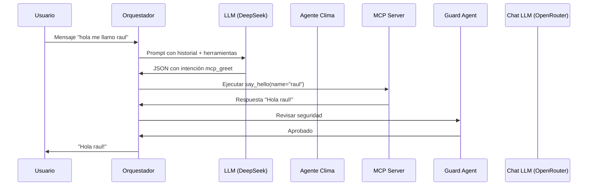

# Arquitectura del Sistema de Agentes LangGraph

## Resumen General

El sistema implementa una arquitectura de **agentes multi-LMM** donde diferentes componentes usan diferentes modelos de lenguaje para tareas específicas, coordinados por un **agente orquestador** central.

## Diagrama de Flujo del Orquestador



## LLMs por Componente

### 1. Agente Orquestador (`poc/agent-orquestador/`)
- **Modelo**: `deepseek-chat`
- **Proveedor**: DeepSeek
- **URL Base**: `https://api.deepseek.com/v1`
- **Uso**: Análisis de intención del usuario y decisión de qué herramienta ejecutar
- **Configuración**: `poc/config.toml` → `[agents.orquestador]`

### 2. Agente de Seguridad (`poc/agent-guard/`)
- **Modelo**: `openai/gpt-oss-safeguard-20b`
- **Proveedor**: OpenRouter
- **URL Base**: `https://openrouter.ai/api/v1`
- **Uso**: Revisión de seguridad de respuestas antes de enviar al usuario
- **Configuración**: `poc/config.toml` → `[agents.guard]`

### 3. Agente de Chat Ligero (`poc/chatCLI/`)
- **Modelo**: `openai/gpt-oss-20b:free`
- **Proveedor**: OpenRouter
- **URL Base**: `https://openrouter.ai/api/v1`
- **Uso**: Respuestas conversacionales cuando no se necesita herramienta
- **Configuración**: `poc/config.toml` → `[agents.chat]`

### 4. Agente Meteorológico (`poc/agent-weather/`)
- **Modelo**: `deepseek-chat`
- **Proveedor**: DeepSeek
- **URL Base**: `https://api.deepseek.com/v1`
- **Uso**: Generación de recomendaciones meteorológicas
- **Configuración**: `poc/config.toml` → `[agents.weather]`

## Flujo de Decisión del Orquestador

### Paso 1: Análisis de Intención
El orquestador recibe el mensaje del usuario y determina la intención:

```python
def analyze_intent(self, user_input: str, history: Sequence[dict[str, str]]) -> IntentAnalysis:
    if self.llm_available:
        return self.analyze_intent_with_llm(user_input, history)
    else:
        return self.analyze_intent_by_rules(user_input, history)
```

#### Opción A: Con LLM (DeepSeek)
1. Construye un prompt con el historial y las herramientas disponibles
2. Envía al modelo `deepseek-chat`
3. Recibe respuesta en formato JSON:
   ```json
   {
     "intent": "weather_query | mcp_greet | general_chat",
     "tool_type": "weather | mcp | chat",
     "tool_name": "weather.get_current_weather | mcp.say_hello | chat.respond",
     "arguments": {"location": "Madrid"} | {"tool_name": "say_hello"} | {},
     "confidence": 0.9,
     "requires_tool": true
   }
   ```

#### Opción B: Con Reglas (Fallback)
Si DeepSeek no está disponible, usa coincidencia de palabras clave:
- **Clima**: Palabras como "clima", "sol", "lluvia", etc.
- **MCP**: Palabras como "hola", "saludar", "idioma", etc.
- **Chat**: Cualquier otro mensaje

**Importante**: Ahora usa coincidencia de palabras completas con expresiones regulares (`\bword\b`) para evitar falsos positivos como "sol" en "raul y son".

### Paso 2: Validación de Herramientas
El `DecisionValidator` verifica que:
1. La herramienta existe en el registro
2. La herramienta está disponible
3. Los argumentos requeridos están presentes
4. Los tipos de argumentos son correctos

### Paso 3: Ejecución de Herramientas
- **Clima**: Ejecuta `weather.get_current_weather` → Consulta API de OpenWeatherMap
- **MCP**: Ejecuta `mcp.say_hello` → Usa el servidor MCP (saludo multilingüe)
- **Chat**: Responde con el LLM ligero de OpenRouter

### Paso 4: Validación de Seguridad
El Guard Agent revisa la respuesta generada:
- Detecta contenido inapropiado
- Verifica que no se inventen capacidades
- Valida que la respuesta sea segura

### Paso 5: Persistencia en Memoria
- Guarda la conversación en memoria semántica (FAISS)
- Almacena resultados de herramientas para contexto futuro

## Diagrama de Comunicación entre Agentes



## Integración de LLMs

### Cómo el Orquestador usa DeepSeek
1. **Inicialización**: En `AgentOrquestador.__init__()`
   ```python
   from deepseek_service import LLMProviderService
   self.llm = LLMProviderService()
   self.llm_available = True
   ```

2. **Análisis de intención**: En `analyze_intent_with_llm()`
   ```python
   response = self.llm.chat(messages)
   parsed, error = DecisionValidator.parse_llm_response(response)
   ```

3. **Configuración**: Lee de `poc/config.toml`
   - Provider: DeepSeek
   - Modelo: `deepseek-chat`
   - URL: `https://api.deepseek.com/v1`

### Cómo el Chat CLI usa OpenRouter
1. **Servicio ligero**: En `llm_service.py`
   ```python
   class LLMLightService:
       def __init__(self, model: str = "openai/gpt-oss-20b:free"):
           self.base_url = "https://openrouter.ai/api/v1"
   ```

2. **Uso**: Para respuestas conversacionales cuando no se necesita herramienta

## Configuración de Models en `poc/config.toml`

```toml
[providers.deepseek]
name = "DeepSeek"
base_url = "https://api.deepseek.com/v1"
models = ["deepseek-chat", "deepseek-coder"]

[providers.openrouter]
name = "OpenRouter"
base_url = "https://openrouter.ai/api/v1"
models = ["openai/gpt-oss-safeguard-20b", "openai/gpt-oss-120b:free"]

[agents.orquestador]
model = "deepseek-chat"
provider = "deepseek"

[agents.guard]
model = "openai/gpt-oss-safeguard-20b"
provider = "openrouter"

[agents.chat]
model = "openai/gpt-oss-20b:free"
provider = "openrouter"
```

## Resumen de Flujos

| Mensaje del Usuario | Intención Detectada | LLM Usado | Herramienta Ejecutada |
|---------------------|---------------------|-----------|----------------------|
| "hola me llamo raul" | `mcp_greet` | DeepSeek | `mcp.say_hello` |
| "saludame en frances" | `mcp_greet` | DeepSeek | `mcp.say_hello` |
| "hace sol en madrid" | `weather_query` | DeepSeek | `weather.get_current_weather` |
| "explícame IA" | `general_chat` | DeepSeek | `chat.respond` (OpenRouter) |

## Notas Importantes

1. **mcp_greet no es una herramienta**: Es una etiqueta de intención interna que se traduce a la ejecución de `mcp.say_hello`

2. **DeepSeek es el LLM principal**: Se usa para análisis de intención en el orquestador

3. **OpenRouter se usa para tareas específicas**:
   - Guard Agent (seguridad)
   - Chat ligero (respuestas conversacionales)
   - Agentes meteorológicos (generación de recomendaciones)

4. **Fallback a reglas**: Si DeepSeek no está disponible, el sistema usa coincidencia de palabras clave