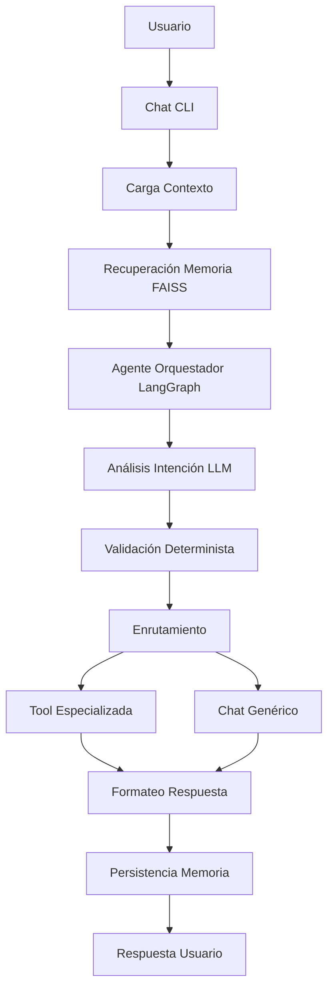

# ARCHITECTURE

## Style
Arquitectura orientada a eventos con LangGraph como motor de control de flujo.

## Modules

| Module | Path | Responsibility |
|--------|------|----------------|
| Chat CLI | `poc/chatCLI/` | Interacción usuario-sistema, entrada/salida de texto |
| Agente Orquestador | `poc/agent-orquestador/` | Decisión, validación y ejecución de herramientas |
| Agente Meteorológico | `poc/agent-weather/` | Herramienta especializada para clima |
| MCP Router | `lib/mcp/` | Punto de acceso a herramientas vía MCP |
| Tool Registry | `poc/agent-orquestador/src/registry/` | Catálogo central de herramientas disponibles |

## Boundaries
- El Chat CLI no decide herramientas ni ejecuta lógica de negocio
- El Orquestador no inventa herramientas ni ejecuta tools no registradas
- Las herramientas especializadas no acceden directamente al historial del usuario
- La memoria semántica (FAISS) no reemplaza el historial conversacional reciente

## Data Flow

## Entry Points
- `poc/chatCLI/src/chat_cli.py` - CLI principal
- `poc/agent-orquestador/src/agents/orquestador_agent.py` - Orquestador LangGraph
- `poc/agent-weather/src/agents/weather_agent.py` - Agente meteorológico
