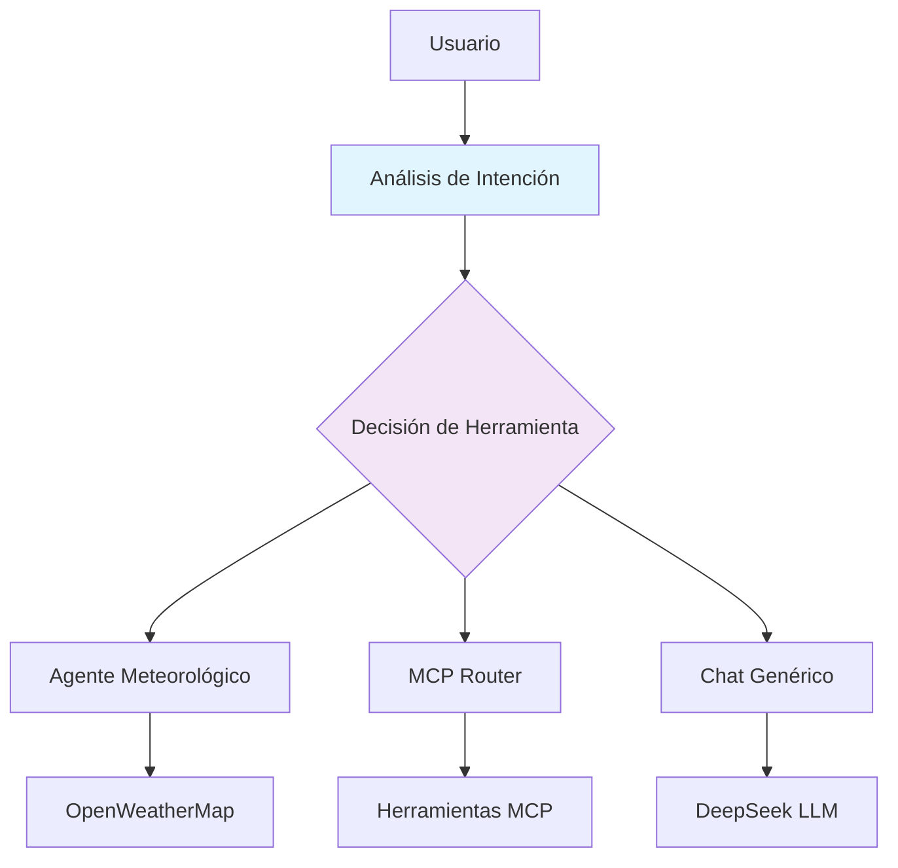

# Agente Orquestador con LangGraph

## Descripción

El **Agente Orquestador** es el cerebro central del sistema. Utiliza LangGraph para orquestar el flujo de ejecución y decidir qué herramienta usar según la intención del usuario.

## Arquitectura



## Estado del Agente

```python
class OrquestadorState(TypedDict):
    user_input: str                    # Entrada del usuario
    intent: Optional[str]              # Intención detectada
    tool_to_use: Optional[ToolType]    # Herramienta a ejecutar
    tool_args: Optional[dict]          # Argumentos para la herramienta
    response: Optional[str]            # Respuesta generada
    history: Sequence[dict]            # Historial de conversación
    error: Optional[str]               # Mensaje de error (si existe)
```

## Flujo de Ejecución

1. **Análisis de Intención con LLM** (`analyze_intent_node`)
   - Utiliza el LLM (DeepSeek) para analizar la intención del usuario
   - Detecta automáticamente la intención y argumentos relevantes
   - Clasifica la intención como:
     - `weather_query`: Consulta de clima
     - `mcp_*`: Comandos MCP (saludo, idiomas, etc.)
     - `general_chat`: Conversación general
   - **Nota**: Si el LLM no está disponible, usa análisis por reglas como fallback

2. **Decisión de Herramienta**
   - Basada en la intención detectada por el LLM, selecciona la herramienta apropiada
   - Extrae argumentos de la entrada (ej: ubicación para clima, nombre para saludos)
   - El LLM determina la confianza de la detección (0.0-1.0)

3. **Ejecución de Herramienta** (`execute_tool_node`)
   - Llama al wrapper correspondiente
   - Procesa el resultado
   - Formatea la respuesta

## Herramientas Disponibles

### 1. Agente Meteorológico
- **Entrada**: Ubicación (ej: "Madrid", "Barcelona")
- **Salida**: Datos del clima + recomendaciones
- **API**: OpenWeatherMap
- **Uso**: Consultas de clima

### 2. MCP Router
- **Herramientas**:
  - `say_hello(name, lang)`: Saludo personalizado
  - `get_hello_languages()`: Lista idiomas
- **Uso**: Comandos directos o saludos

### 3. Chat Genérico
- **API**: DeepSeek LLM
- **Uso**: Conversación general

## Ejemplos de Uso

### Consulta de Clima
```
Usuario: "¿Cómo está el clima en Madrid?"
Intención: weather_query
Herramienta: Agente Meteorológico
Resultado: Datos del clima + recomendaciones
```

### Saludo MCP
```
Usuario: "say_hello(name=Juan, lang=es)"
Intención: mcp_say_hello
Herramienta: MCP Router
Resultado: "¡Hola Juan!"
```

### Conversación General
```
Usuario: "Hola, ¿cómo estás?"
Intención: general_chat
Herramienta: Chat Genérico
Resultado: Respuesta conversacional
```

## Instalación

```bash
cd poc/agent-orquestador
python3 -m venv venv
source venv/bin/activate
pip install -r requirements.txt
```

## Configuración del LLM

El agente orquestador utiliza el LLM (DeepSeek) para el análisis de intención. Para configurar el LLM:

1. **Variables de entorno** (en `.env` o variables de sistema):
   ```
   LLM_PROVIDER_API_KEY=your_api_key_here
   LLM_PROVIDER_API_BASE=https://api.deepseek.com/v1
   LLM_PROVIDER_MODEL=deepseek-chat
   ```

2. **Backward compatibility** con variables antiguas de DeepSeek:
   - `DEEPSEEK_API_KEY`
   - `DEEPSEEK_API_BASE`
   - `DEEPSEEK_MODEL`

3. **Fallback**: Si el LLM no está disponible, el agente orquestador usa análisis por reglas como fallback automático.

## Cómo funciona el LLM en el análisis de intención

El LLM recibe:
- **Sistema**: Instrucciones sobre herramientas disponibles y formato de salida
- **Historial**: Conversaciones recientes para contexto
- **Usuario**: Mensaje actual del usuario

El LLM devuelve un JSON con:
```json
{
  "intent": "string describiendo la intención",
  "tool_type": "weather" | "mcp" | "chat",
  "tool_name": "nombre de la herramienta MCP (solo si tool_type es mcp)",
  "arguments": {"key": "value"},
  "confidence": 0.0-1.0
}
```

## Pruebas

```bash
# Probar agente orquestador
cd poc/agent-orquestador
source venv/bin/activate
python3 test_orquestador.py

# Probar Chat CLI con agente orquestador
cd poc/chatCLI
source venv/bin/activate
echo -e "¿Cómo está el clima en Madrid?\nsalir" | python src/chat_cli.py
```

## Estructura de Código

```
poc/agent-orquestador/
├── src/
│   ├── agents/
│   │   └── orquestador_agent.py    # LangGraph StateGraph
│   ├── schemas/
│   │   └── orquestador.py           # Modelos de datos
│   ├── services/
│   │   ├── weather_agent_wrapper.py # Wrapper agente meteorológico
│   │   └── mcp_wrapper.py           # Wrapper MCP
│   └── __init__.py
├── test_orquestador.py             # Pruebas unitarias
└── requirements.txt                # Dependencias
```

## Próximos Pasos

1. **Integración completa del agente meteorológico** con API Key
2. **Añadir más herramientas MCP** al router
3. **Crear pruebas automatizadas** con pytest
4. **Documentar API completa** en `docs/api.md`
5. **Mejorar prompts del LLM** para mayor precisión en la detección de intenciones

## Referencias

- [LangGraph Documentation](https://langchain-ai.github.io/langgraph/)
- [LangGraph StateGraph](https://langchain-ai.github.io/langgraph/concepts/)
