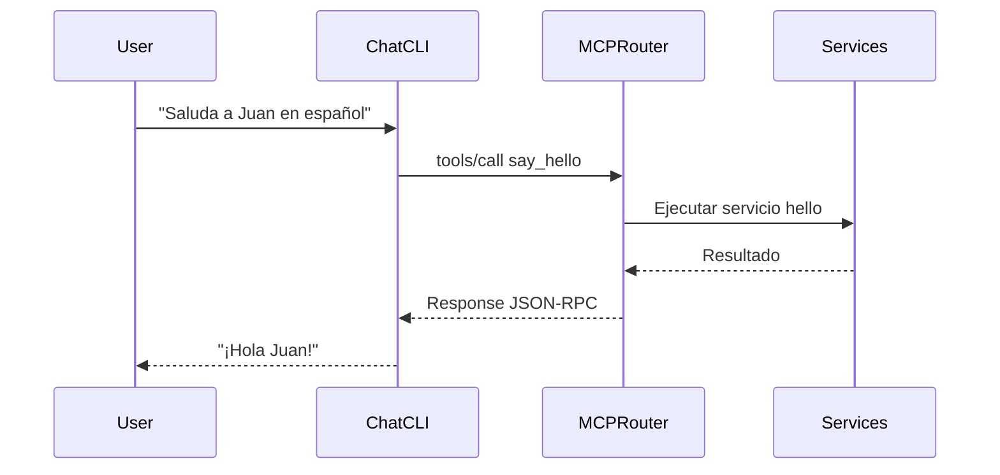

# Arquitectura MCP (Model Context Protocol)

## Descripción General

El proyecto ahora utiliza MCP (Model Context Protocol) para la comunicación entre componentes. MCP es un protocolo estándar para conectar LLMs con recursos y herramientas externos.

## Componentes

### 1. Router MCP (`lib/mcp/router.py`)

El router central que unifica todos los servicios MCP:

```python
class MCPRouter:
    """Router que maneja múltiples servicios MCP."""
    
    def __init__(self):
        self.tools: Dict[str, Callable] = {}
        self.resources: Dict[str, Callable] = {}
        self.prompts: Dict[str, Callable] = {}
```

**Funcionalidades:**
- Gestiona herramientas, recursos y prompts
- Proporciona interfaz JSON-RPC para comunicación
- Soporta inicialización, listado y ejecución

### 2. Servicios MCP

#### Servicio Hello (`lib/mcp/hello/`)
- **Herramientas:**
  - `say_hello(name, lang)`: Saludo personalizado
  - `get_hello_languages()`: Idiomas soportados
- **Recursos:**
  - `hello://service-overview`: Información del servicio
- **Prompts:**
  - `greet-user`: Plantilla para saludos

#### Servicio Clima (integración)
- **Herramientas:**
  - `get_weather(location)`: Consulta del clima
- **Recursos:**
  - `weather://current`: Clima actual
- **Prompts:**
  - `weather-report`: Reporte meteorológico

### 3. Chat CLI (`poc/chatCLI/src/chat_cli.py`)

Cliente que utiliza el router MCP:

```python
# Inicializar router MCP
mcp_router = MCPRouter()

# Ejecutar herramienta MCP
request = {
    "method": "tools/call",
    "id": 1,
    "params": {
        "name": "say_hello",
        "arguments": {"name": "Juan", "lang": "es"}
    }
}
response = mcp_router.handle_request(request)
```

## Flujo de Comunicación



## Implementación Actual

### Chat CLI con MCP

1. **Inicialización:**
   ```python
   from mcp.router import MCPRouter
   mcp_router = MCPRouter()
   ```

2. **Ejecución de herramientas:**
   ```python
   request = {
       "method": "tools/call",
       "params": {
           "name": "say_hello",
           "arguments": {"name": name, "lang": lang}
       }
   }
   response = mcp_router.handle_request(request)
   ```

3. **Comandos MCP en Chat:**
   - `mcp list-tools`: Listar herramientas disponibles
   - `say_hello(nombre, idioma)`: Ejecutar herramienta

### Memoria Temporal con FAISS

El chat CLI mantiene memoria temporal usando FAISS:

1. **Almacenamiento:** Mensajes se convierten a vectores TF-IDF
2. **Búsqueda:** Recuperación de contexto relevante
3. **Limpieza:** Memoria se borra al cerrar sesión

## Próximos Pasos

1. **Integrar servicios de clima** en el router MCP
2. **Actualizar Chat CLI** para usar herramientas MCP
3. **Crear pruebas de integración** para MCP
4. **Documentar API MCP** en `docs/api.md`

## Referencias

- [MCP Specification](https://modelcontextprotocol.io)
- [Repositorio ejemplo](~/repository/github/rafex/mcp-example)
