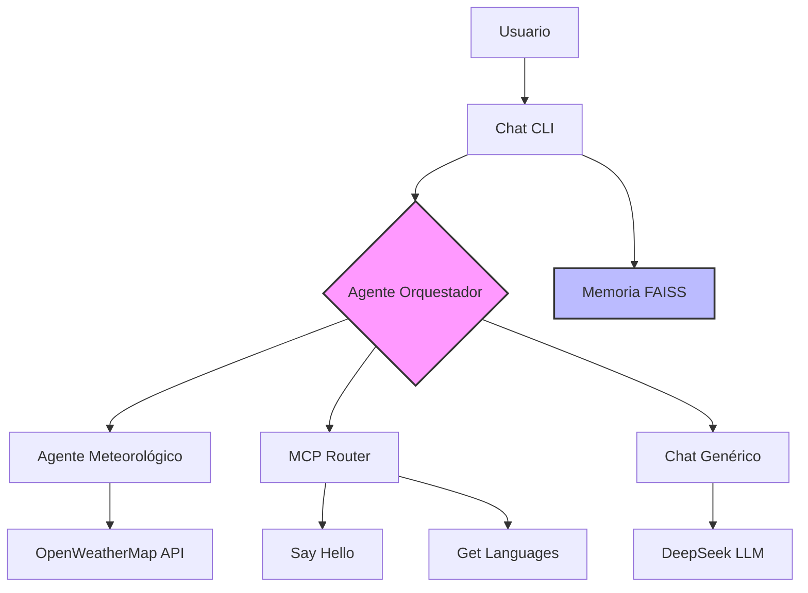
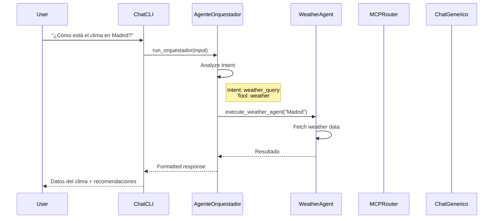

# Arquitectura del Sistema: MCP + Agente Orquestador

## Descripción General

El proyecto utiliza una arquitectura modular con:
1. **MCP (Model Context Protocol)**: Protocolo estándar para conectar LLMs con recursos y herramientas externos
2. **Agente Orquestador**: Cerebro central con LangGraph que decide qué herramienta usar según la intención del usuario
3. **Memoria Temporal**: FAISS para mantener contexto de conversación durante la sesión

## Arquitectura del Sistema



## Componentes Principales

### 1. Agente Orquestador (`poc/agent-orquestador/`)

Cerebro central que orquesta el flujo de ejecución usando LangGraph:

```python
class OrquestadorState(TypedDict):
    """Estado del agente orquestador"""
    user_input: str
    intent: Optional[str]
    tool_to_use: Optional[ToolType]
    tool_args: Optional[dict[str, Any]]
    response: Optional[str]
    history: Sequence[dict[str, str]]
    error: Optional[str]
```

**Funcionalidades:**
- **Análisis de intención**: Detecta si el usuario quiere clima, saludo MCP o conversación general
- **Decisión de herramienta**: Usa LangGraph StateGraph para orquestar el flujo
- **Ejecución condicional**: Llama al agente meteorológico, MCP Router o Chat genérico

**Flujo LangGraph:**
```
Analyze Intent → Execute Tool → End
```

### 2. Wrappers de Servicios

#### Weather Agent Wrapper
- **Conexión con agente meteorológico** usando subprocess
- **Extracción de ubicación** de texto del usuario
- **Manejo de errores** sin API Key

#### MCP Wrapper
- **Conexión con MCP Router** usando JSON-RPC
- **Ejecución de herramientas**: `say_hello`, `get_hello_languages`
- **Listado de herramientas** disponibles

### 3. Router MCP (`lib/mcp/router.py`)

Unificador de servicios MCP:

```python
class MCPRouter:
    def __init__(self):
        self.tools: Dict[str, Callable] = {}
        self.resources: Dict[str, Callable] = {}
        self.prompts: Dict[str, Callable] = {}
```

**Herramientas disponibles:**
- `say_hello(name, lang)`: Saludo personalizado en 10 idiomas
- `get_hello_languages()`: Lista idiomas soportados

### 4. Chat CLI (`poc/chatCLI/src/chat_cli.py`)

Cliente principal que ahora usa el agente orquestador:

```python
if ORQUESTADOR_AVAILABLE:
    orquestador_result = run_orquestador(user_input, conversation_history)
    response_text = orquestador_result['response']
else:
    # Fallback a agente meteorológico directo
    ...
```

**Comandos disponibles:**
- `mcp list-tools`: Listar herramientas MCP
- `say_hello(name=Juan, lang=es)`: Ejecutar herramienta directamente
- Consultas de clima: "¿Cómo está el clima en Madrid?"

### 5. Memoria Temporal con FAISS

Almacenamiento de contexto durante la sesión:

1. **Almacenamiento**: Mensajes convertidos a vectores TF-IDF
2. **Búsqueda**: Recuperación de contexto relevante usando similitud coseno
3. **Limpieza**: Memoria se borra al cerrar sesión

## Flujo de Comunicación



## Implementación Actual

### Chat CLI con Agente Orquestador

1. **Inicialización:**
   ```python
   from src.agents.orquestador_agent import run_orquestador
   ```

2. **Ejecución:**
   ```python
   result = run_orquestador(user_input, conversation_history)
   if result['success']:
       response_text = result['response']
   ```

3. **Análisis de intención automático:**
   - **Clima**: Detecta palabras como "clima", "temperatura", "lluvia"
   - **MCP**: Detecta comandos directos o palabras como "saludar"
   - **Chat**: Conversación general

### Ejemplos de Uso

```
Usuario: "¿Cómo está el clima en Madrid?"
→ Agente Orquestador detecta weather_query
→ Ejecuta agente meteorológico
→ Devuelve datos del clima + recomendaciones

Usuario: "say_hello(name=Juan, lang=es)"
→ Agente Orquestador detecta mcp_say_hello
→ Ejecuta herramienta MCP
→ Devuelve "¡Hola Juan!"

Usuario: "Hola, ¿cómo estás?"
→ Agente Orquestador detecta conversación general
→ Usa chat genérico con DeepSeek
```

## Estructura de Directorios

```
poc/agent-orquestador/
├── src/
│   ├── agents/
│   │   └── orquestador_agent.py  # LangGraph StateGraph
│   ├── schemas/
│   │   └── orquestador.py         # Modelos de datos
│   ├── services/
│   │   ├── weather_agent_wrapper.py
│   │   └── mcp_wrapper.py
│   └── __init__.py
├── requirements.txt
├── test_orquestador.py
└── venv/

lib/mcp/
├── router.py                      # MCP Router unificado
├── hello/python/
│   ├── server.py
│   └── hello_service.py

poc/chatCLI/src/
├── chat_cli.py                    # Cliente con agente orquestador
└── memory_manager.py              # FAISS para memoria temporal
```

## Próximos Pasos

1. **Integración completa del agente meteorológico** con API Key
2. **Más herramientas MCP** para el router
3. **Mejorar análisis de intención** con LLM
4. **Crear pruebas automatizadas** para el agente orquestador
5. **Documentar API completa** en `docs/api.md`

## Referencias

- [MCP Specification](https://modelcontextprotocol.io)
- [LangGraph Documentation](https://langchain-ai.github.io/langgraph/)
- [Repositorio ejemplo MCP](~/repository/github/rafex/mcp-example)
